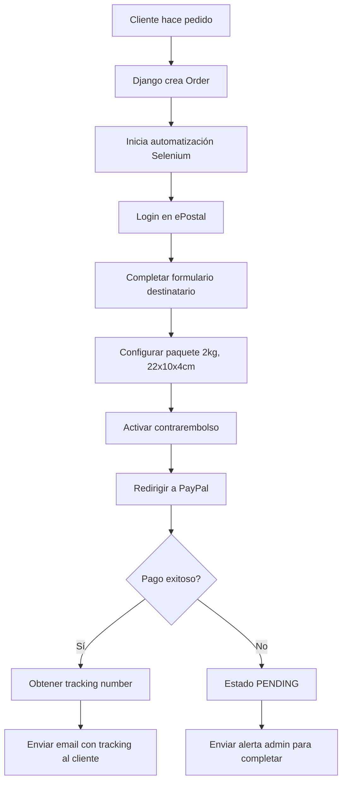

# 🔧 Documentación Técnica - Sistema de Automatización PadelStats

## 📋 Resumen del Sistema

El sistema PadelStats incluye automatización completa para la creación de envíos contrarembolso usando:
- **ePostal (Correos España)**: Plataforma oficial para envíos
- **Selenium WebDriver**: Automatización del navegador 
- **PayPal**: Pago automático de costos de envío
- **Django Email**: Notificaciones automáticas

## 🛠️ Configuración Técnica

### 1. Instalación de Dependencias

```bash
# Backend requirements
cd backend
pip install -r requirements.txt
```

**requirements.txt actualizado:**
```
Django==5.0.8
djangorestframework==3.15.2
django-cors-headers==4.3.1
Pillow==10.4.0
python-dotenv==1.0.0
selenium==4.15.2
webdriver-manager==4.0.1
```

### 2. Configuración de Credenciales

Crear archivo `backend/correos_settings.py`:

```python
# CREDENCIALES EPOSTAL
EPOSTAL_USERNAME = "tu_usuario_epostal"
EPOSTAL_PASSWORD = "tu_password_epostal"

# CREDENCIALES PAYPAL  
PAYPAL_EMAIL = "tu_email_paypal"
PAYPAL_PASSWORD = "tu_password_paypal"

# CONFIGURACIÓN SELENIUM
CHROMEDRIVER_PATH = None  # Auto-detectar
SELENIUM_VISIBLE = True   # False para headless
SELENIUM_TIMEOUT = 20
```

### 3. Configuración Django Email

En `backend/padelstats_backend/settings.py`:

```python
EMAIL_BACKEND = 'django.core.mail.backends.smtp.EmailBackend'
EMAIL_HOST = 'smtp.gmail.com'
EMAIL_PORT = 587
EMAIL_USE_TLS = True
EMAIL_HOST_USER = 'padelstats0@gmail.com'
EMAIL_HOST_PASSWORD = 'tu_app_password_gmail'
DEFAULT_FROM_EMAIL = 'padelstats0@gmail.com'
```

## 🔄 Flujo de Automatización

### Proceso Completo:



### Estados de Pedido:

- **`pending`**: Pedido creado, iniciando proceso
- **`processing`**: Automatización en progreso, pago pendiente
- **`shipped_and_paid`**: Completado exitosamente con tracking
- **`failed`**: Error, requiere intervención manual

## 🎯 Campos del Formulario ePostal

### Datos del Destinatario (mapeo real):
```python
FORM_MAPPING = {
    'nombre': order.customer_name.split()[0],
    'primerApellido': order.customer_name.split()[1] if len(split_name) > 1 else '',
    'segundoApellido': order.customer_name.split()[2] if len(split_name) > 2 else '',
    'empresa': '',
    'direccion': order.street_address,
    'codigoPostal': order.postal_code,
    'localidad': order.city,
    'provincia': _get_provincia_from_city(order.city),
    'movilSMS': order.phone,
    'telefonoContacto': order.phone,
    'email': order.customer_email
}
```

### Especificaciones del Paquete:
```python
PACKAGE_SPECS = {
    'peso': '2',           # kg
    'alto': '4',           # cm  
    'ancho': '10',         # cm
    'largo': '22',         # cm
    'referenciaCliente1': 'PadelStats',
    'referenciaCliente2': 'Sensor'
}
```

### Contrarembolso:
```python
CONTRAREMBOLSO = {
    'checkbox': 'reembolsoDomicilio',
    'importe_field': 'importeReembolsoDomicilio',
    'amount': order.total_amount + 5.99  # Productos + envío
}
```

## 🔧 Métodos Principales de la Clase CorreosAutomationService

### `automatizar_envio_completo(order)`
Método principal que ejecuta todo el flujo.

### `_hacer_login()`
Inicia sesión en ePostal con credenciales.

### `_navegar_crear_envio()` 
Navega a la página de crear nuevo envío.

### `_completar_destinatario(order)`
Completa formulario con datos del cliente.

### `_configurar_paquete()`
Configura especificaciones del paquete PadelStats.

### `_activar_contrarembolso(order, total_amount)`
Activa contrarembolso en domicilio con importe total.

### `_procesar_pago_paypal()`
Maneja la redirección y pago en PayPal.

### `_obtener_numero_tracking()`
Extrae el número de seguimiento de la confirmación.

## 🚨 Manejo de Errores

### Tipos de Error:

1. **Login Error**: Credenciales incorrectas
   - Verificar usuario/password ePostal
   - Revisar cambios en página de login

2. **Timeout Error**: Elementos no encontrados
   - Aumentar SELENIUM_TIMEOUT
   - Verificar cambios en estructura web ePostal

3. **PayPal Error**: Fallo en pago
   - Verificar credenciales PayPal  
   - Comprobar saldo disponible
   - Desactivar 2FA para automatización

4. **Form Error**: Campos no encontrados
   - ePostal cambió estructura del formulario
   - Actualizar mapeo de campos

### Logs y Debug:

```python
import logging

logger = logging.getLogger('correos_automation')
logger.setLevel(logging.INFO)

# Los logs incluyen:
# - Cada paso del proceso
# - Errores con contexto
# - Valores de campos completados
# - Timeouts y esperas
```

## 📧 Sistema de Notificaciones

### Email al Cliente (pedido exitoso):
```
Asunto: ✅ Tu pedido PadelStats #123 ha sido enviado

Hola Juan,

Tu pedido ha sido enviado correctamente:

📦 Número de seguimiento: AB123456789ES
🚚 Transportista: Correos España
💰 Importe contrarembolso: €65.98

Puedes seguir tu envío en: 
https://www.correos.es/ss/Satellite/site/seguimiento

¡Gracias por confiar en PadelStats!
```

### Email al Admin (automatización exitosa):
```
Asunto: ✅ Envío automatizado exitoso #123

ENVÍO CREADO AUTOMÁTICAMENTE

Pedido: #123
Cliente: Juan Pérez
Tracking: AB123456789ES
Total contrarembolso: €65.98

El proceso se completó sin intervención manual.
```

### Email al Admin (proceso pendiente):
```
Asunto: 🟡 PROCESO PENDIENTE #123 - Completar pago PayPal

PROCESO INICIADO - REQUIERE COMPLETAR

El envío se ha iniciado en ePostal pero requiere
completar el pago manualmente en PayPal.

Acceder a: https://www.epostal.correos.es/
Completar pago (~€6.50) y obtener tracking.
```

## 🛡️ Seguridad

### Buenas Prácticas Implementadas:

1. **Credenciales Separadas**: No en código, en archivo externo
2. **Gitignore**: correos_settings.py excluido del repositorio  
3. **Timeouts**: Evitar procesos colgados
4. **Error Handling**: Capturas específicas para cada caso
5. **Logs Sin Datos Sensibles**: No loguear passwords
6. **Webdriver Stealth**: Evitar detección de automatización

## 🔍 Testing y Debug

### Modo Debug:
```python
# En correos_settings.py
SELENIUM_VISIBLE = True      # Ver navegador en acción
SELENIUM_TIMEOUT = 30        # Más tiempo para debug
```

### Verificar Configuración:
```python
# Test básico en Django shell
from orders.correos_automation import CorreosAutomationService

automation = CorreosAutomationService()
# Verificar que carga credenciales correctamente
```

### Logs de Debug:
```bash
# Ver logs en tiempo real
tail -f django_logs.log | grep correos_automation
```

## 🚀 Optimizaciones

### Performance:
- WebDriverWait para esperas inteligentes
- Selectores CSS optimizados  
- Reutilización de sesión navegador
- Timeouts configurables

### Robustez:
- Múltiples selectores de fallback
- Retry logic para elementos críticos
- Screenshots automáticos en errores
- Cleanup automático del navegador

## 📊 Monitorización

### Métricas Recomendadas:
- % de automatizaciones exitosas
- Tiempo promedio de procesamiento  
- Errores más frecuentes
- Volumen de pedidos procesados

### Alertas:
- Múltiples fallos consecutivos
- Cambios en estructura ePostal
- Problemas de credenciales PayPal
- Timeouts recurrentes

---

*Documentación técnica actualizada para automatización completa PadelStats*